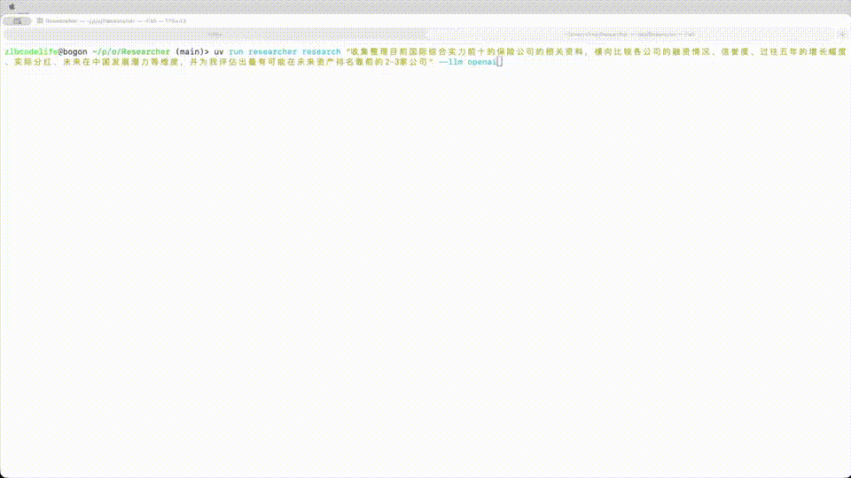

# Researcher

[English](/README.md) | [简体中文](/README.zh-CN.md)

A minimal-scaffold deep research system powered by multi‑agent collaboration (Orchestrator, Searcher, Analyzer, Writer) with a real‑time terminal UI.

<!-- Hero Demo: GitHub 上 GIF 自动循环播放 -->

  

## Motivation

现有的 deep research 系统，大多遵循「并发收集信息 → 汇总写作」的流水线式脚手架。  
随着模型能力的提升，这种流程被设计得越精细，反而越容易限制模型自身的思考与规划能力。  
本项目的目标，是探索一种「脚手架尽量少、自由度尽量高」的 deep research 形态。

核心思路是：围绕一个主 Agent，为它提供一组以工具形式存在的助理 Agent（agent-as-tool），例如搜索 Agent、分析 Agent 等。主 Agent 不再被固定在某个预设流程里，而是根据研究目标自主调用这些工具，决定何时搜索、何时分析、何时写作。

为了解决「多个助理 Agent 产生大量内容，主 Agent 无法全部读完」的问题，本项目引入了一个分层记忆与阅读机制：
- 助理 Agent 不直接把长篇内容塞回上下文，而是持久化到文件系统，**由 Agent 自己决定如何组织信息结构**
- 返回给主 Agent 的只是「简要摘要 + 文件索引」，主 Agent 如有需要，可以通过文件操作工具按需读取细节
- 主 Agent 通过「概览 → 选点下钻 → 再行动」的节奏组织研究

通过这种方式，主 Agent 可以在有限上下文内进行高层规划和决策；助理 Agent 则负责扩展记忆与信息深度。最终形成一个**脚手架极简、以工具化多 Agent 和文件系统为基础、支持分层阅读和长期积累**的 deep research 系统。

## Quick Start

- Requirements
  - `Python >= 3.11`
  - `uv` (recommended) or `pip`
  - An LLM API key: Anthropic (默认) 或 OpenAI；可选 Tavily 搜索 API

- Install
  - Clone 本仓库后，在项目根目录执行：
    - 使用 uv（推荐）：`uv sync`
    - 或使用 pip：`python -m venv .venv && source .venv/bin/activate && pip install -e .`

- Configure
  - 将 `.env.example` 复制为 `.env` 并填入你的 Key，或在 shell 中导出环境变量：
    - Anthropic（默认提供商）
      - `export ANTHROPIC_API_KEY="your-key"`
      - 可选：`export ANTHROPIC_MODEL="claude-3-5-sonnet-20241022"`
    - OpenAI（或兼容，如自托管网关）
      - `export OPENAI_API_KEY="your-key"`
      - 可选：`export OPENAI_BASE_URL="https://api.openai.com/v1"`
      - 可选：`export OPENAI_MODEL="gpt-4o"`
    - Tavily Search（用于网页搜索）
      - `export TAVILY_API_KEY="your-key"`

- Run
  - 最小示例（带可视化 UI）：
    - `uv run researcher research "Python async/await best practices"`
  - 指定模型或切换到 OpenAI：
    - `uv run researcher research "RAG best practices" --llm openai -m gpt-4o`
  - 无 UI（适合脚本/CI）：
    - `uv run researcher research "topic overview" --no-ui`
  - 继续已有工作：
    - `uv run researcher continue-research -w ./workspace/<id> -t "Add more details"`
  - 列出历史项目：
    - `uv run researcher list-research`

## Examples

- 最小示例（带 UI）：
  - `uv run researcher research "Python async/await best practices"`
- 指定工作目录与步数：
  - `uv run researcher research "RAG best practices" -w ./workspace/rag-demo -s 50`
- 导出报告到标准输出（配合 tee 保存）：
  - `uv run researcher research "topic overview" -r - | tee report.md`
- 继续已有项目并补充任务：
  - `uv run researcher continue-research -w ./workspace/<id> -t "Add more details"`

## What You Get

- 运行后会在 `./workspace/<auto-id>/` 创建工作目录：
  - `question.txt`：原始研究问题
  - 若写作完成：`FINAL_REPORT.md`（单文件完整报告，位于该工作区根目录）
  - 其他中间文件由代理自行组织

## TODO_LIST

- running DeepResearch Bench
